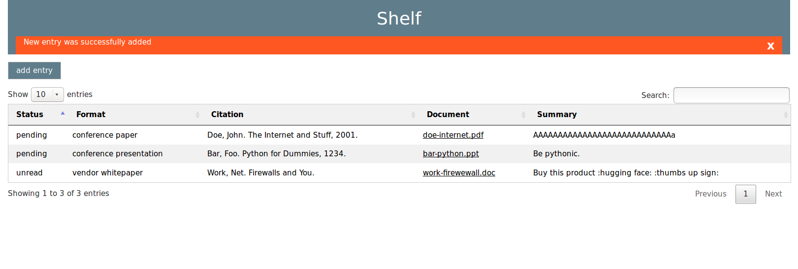
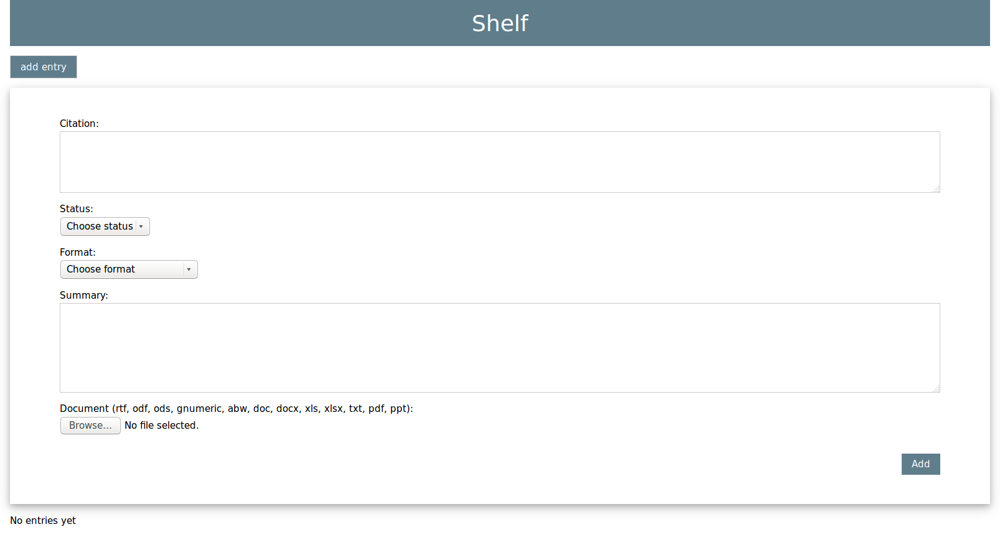

# Shelf
Shelf is a simple Flask app that provides a bookshelf for your digital readings.




# Installation
## In a Virtual Environment (optional)
```
virtualenv ~/pyenv/shelf
source ~/pyenv/shelf/bin/activate
```

## Dependencies
`pip install -r requirements.txt`

# Usage
## Initialization
1. Verify configuration values in *shelf/init.py* and *shelf/shelf/config.py*
2. `python shelf/init.py`

## Run Server
3. `python shelf/runserver.py`
